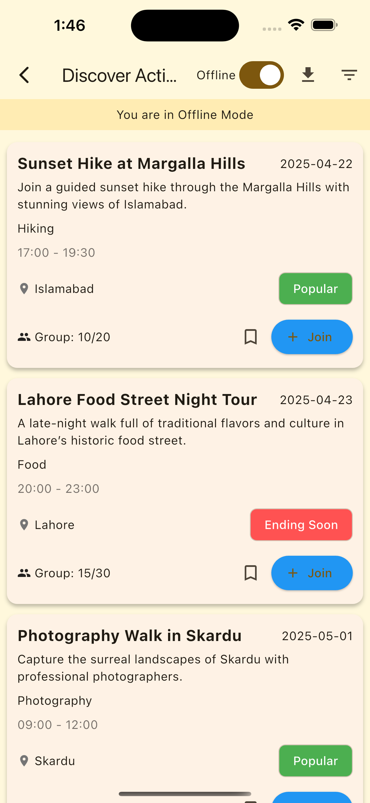
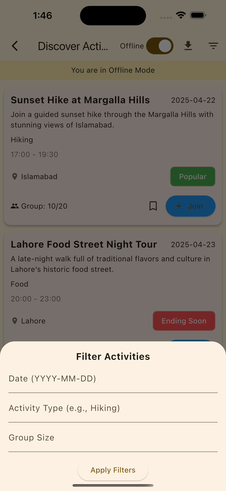

# 🧭 Travel Activity & Event Discovery App (Flutter + BLoC + SQLite)

A simple Flutter module to help solo travelers discover activities and events in
their destination city. Built with **clean architecture (simplified)**, **BLoC
state management**, and **offline support** via SQLite.

> 💡 Perfect as a starting point for event-based apps or offline-first mobile
> experiences.

---

## ✨ Features

- 🔍 **Activity Feed**: Scrollable list of travel-friendly activities/events
- 🧰 **Filtering**: Filter by date, activity type, or group size
- 📶 **Offline Mode**: Switch between online mock API and offline SQLite cache
- ✅ **Persistent Actions**: Save or join activities and keep them cached
- ⚙️ **Clean Structure**: Uses simplified clean architecture (Presentation +
  Data Layer)

---

## 📸 Screenshots

| Discovery Feed                        | Filter                                |
| ------------------------------------- | ------------------------------------- |
|  |  |

---

## 🛠 Tech Stack

- 🐦 Flutter (with null safety)
- 📦 BLoC (flutter_bloc)
- 💾 SQLite (sqflite package)
- 🧪 Mock API using in-memory service
- 🎯 Clean Architecture (simplified for clarity)

---

## 🚀 Getting Started

1. **Clone the repo**

```bash
git clone https://github.com/DholaSain/TravelActivity-BloC-Test-App.git
cd TravelActivity-BloC-Test-App
```

2. **Install dependencies**

```bash
flutter pub get
```

3. **Run the app**

```bash
flutter run
```

## 📌 Use Case

This project is great if you're:

- Learning offline-first development
- Exploring BLoC in a real-world example
- Building an event or meetup app
- Wanting a starter clean architecture setup

## 🤝 Contributing

Pull requests are welcome! If you find a bug or want to improve anything, feel
free to open an issue or submit a PR.
